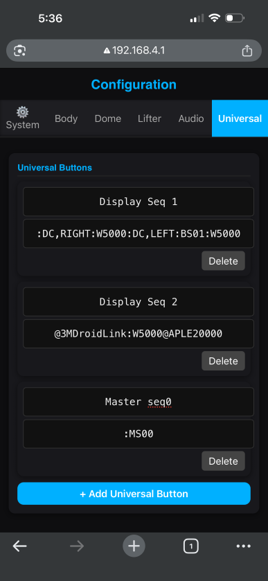

---

## 🔗 Using Chained Commands from the Display

In addition to triggering Master Sequences (`:MSnn`),  
Display buttons can send chained commands directly.

A chained command is multiple commands sent in one string.

Example:
:BS00:W5000

This means:

1. Run Body Sequence 00
2. Wait 5000 milliseconds (5 seconds)

The `:W` command creates a delay between actions.

Chained commands allow you to create simple timed behaviors directly from a Display button without needing to create a full Master Sequence.

---

### Example Use Case

Create a button in the **Body** or **Universal** tab.

Set the command to:
:BS00:W1000:DS02

This will:

- Run Body Sequence 00
- Wait 1 second
- Run Dome Sequence 02

All from a single button press.

---

### When to Use Chained Commands vs Master Sequences

Use chained commands when:

- The behavior is short
- You only need 1–6 simple steps
- You want quick testing

---

## 📸 Display Sequence Screen Example

The image below shows three Display buttons:

- **Display Seq 1** – Chained native DroidLink commands  
- **Display Seq 2** – Chained external serial commands  
- **Master Seq 0** – Stored Master Sequence call  

---

### 🔹 Display Seq 1

Command:
:DC,RIGHT:W5000:DC,LEFT:BS01:W5000

This button will:

1. Spin the dome RIGHT  
2. Wait 5 seconds  
3. Spin the dome LEFT  
4. Call Body Maestro Sequence 01  
5. Wait another 5 seconds  

This is a fully chained native command using `:DC`, `:BS`, and `:W`.

---

### 🔹 Display Seq 2

Command:
@3MDroidLink:W5000@APLE20000

This button will:

1. Scroll "DroidLink" on the Rear Logic Display (AstroPixelsplus)  
2. Wait 5 seconds  
3. Set AstroPixels to failure mode  

This demonstrates chaining external serial commands with a delay between them.

---

### 🔹 Master Seq 0

Command:
:MS00

This button triggers a stored Master Sequence.

All timing and behavior are handled inside the Master Sequence itself.

---

### What This Example Demonstrates

- Display buttons can send raw chained commands
- Native (`:`) and external (` : * @ # ! % etc`) commands can be mixed
- Delays (`:Wxxxx`) apply within the same chain
- Master Sequences provide reusable structured behavior

This gives you two ways to build behavior:

- **Inline chaining (quick and direct)**
- **Stored Master Sequences (organized and reusable)**

---

## 📘 Command Reference

Want to explore all available DroidLink commands,  
including advanced system, audio, dome, and chaining options?

👉 **[DroidLink Command Reference →](DroidLink_Command_Reference.md)**
