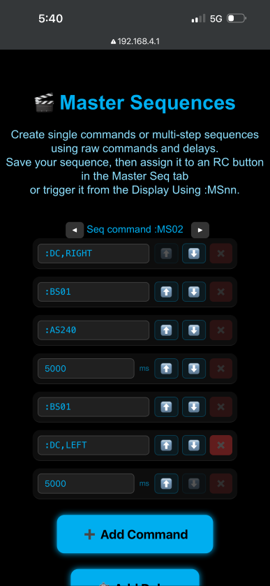

# 🎬 Creating a Master Sequence

Master Sequences allow you to create single commands or multi-step command chains that can be triggered from:

- The **Master Seq** tab (RC button mapping)
- The **Display**
- A direct command using `:MSnn`

Each sequence slot is identified by a number:

MS00 → MS32

---

## 🔧 Step 1 — Open Master Sequences

1. Power on your Master Controller.
2. Connect to the Master Config web interface.
3. Click **Master Sequences**.

You will see:

- ◀ ▶ navigation buttons  
- A label showing the current slot (example: `Editing: MS00`)
- Buttons to add commands or delays
- Save button

---

## 🔢 Step 2 — Select a Sequence Slot

Use the ◀ and ▶ buttons to choose the sequence number you want to edit.

Example: 

Editing: MS05

This means you are editing Master Sequence 05.

---

## ➕ Step 3 — Add a Command

Click:

➕ Add Command

In the input field, enter a valid DroidLink command, for example:
- :AS005
- :BS01
- @APLE14000

You may chain commands later by adding multiple rows.

---

## ⏱ Step 4 — Add a Delay (Optional)

Click:
⏱ Add Delay

A new row will appear
Enter a time in milliseconds.

Example:
1000

This creates a 1 second delay before the next step runs.

---

## 🧱 Example Sequence

Example: Play sound, wait 5 seconds, spin dome left.

| Step | Type  | Value      |
|------|-------|------------|
| 1    | CMD   | `:DC,LEFT` |
| 2    | DELAY | `5000`     |
| 3    | CMD   | `:AS005`   |

When triggered, the Master will:

1. Spin dome left  
2. Wait 5 seconds  
3. Play Track 5  

---

## 💾 Step 5 — Save

Click:
💾 Save

This stores the sequence in the Master’s configuration.

If you leave without saving, changes will be lost.

---

## 🎮 Assigning to an RC Button

To trigger a Master Sequence from your controller:

1. Go to **RC Controls**
2. Select the **Master Seq** tab
3. Choose an event (example: `DriveA`)
4. Enter the sequence number (example: `05`)

This will trigger:
:MS05

when that RC event occurs.

---

## 📱 Triggering from Display

You can also trigger a Master Sequence from the Display by sending:
:MSnn

---

## 🛑 Notes

- Master Sequences run in the order listed.
- Delays are in milliseconds.
- Use realistic delay timing to avoid overlapping actions.
- The maximum number of steps per sequence may be limited.

---

## 📸 Master Sequence Screen

## Example Sequence Explanation

This example sequence will:

- This is V1.1 New Users will need to upload New master fimware in OTA mode. 
- Start the dome turning **RIGHT**
- Call Body Maestro Sequence 1  
- Start track 240  
- Wait 5 seconds (non-blocking — foot drives will still work)  
- Call Body Maestro Sequence 1 again  
- Change the dome direction to **LEFT**  
- Wait 5 seconds  

---

## Important Timing Notes

This is all based on timing.

- The dome will start  
- Maestro will start  
- Audio will start  

Those three will begin in that order with little to no delay between them.

The 5-second timer starts immediately as well, so you must make sure the Maestro sequence you are running has enough time to complete before you call it again.

So after the wait, the body maestro and the dome are instantly going to take effect. 

The final 5-second delay at the end ensures the Maestro sequence completes before the dome stops spinning.

Audio will continue playing unless you stop it manually using `:AS00`.

---

## 📱 Next Step — Creating Display Sequences

Now that you understand how Master Sequences work,  
learn how to trigger and chain them from the Display.

👉 **[Creating Display Sequences →](Creating_Display_Sequences.md)**
