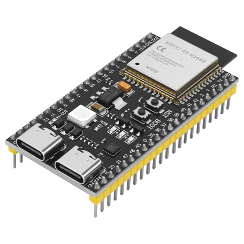
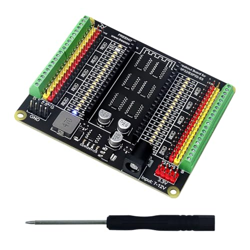
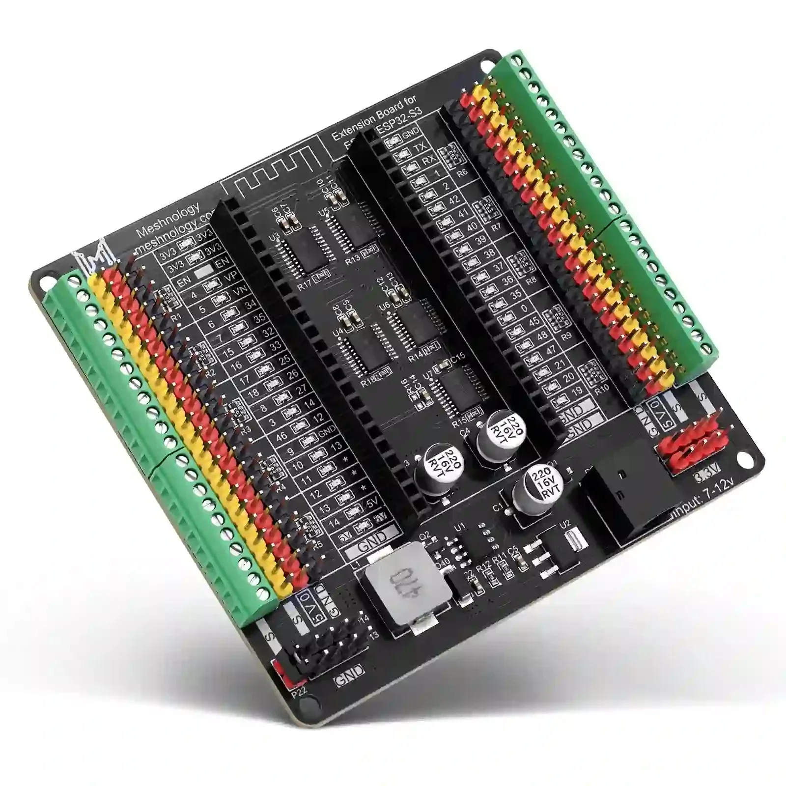
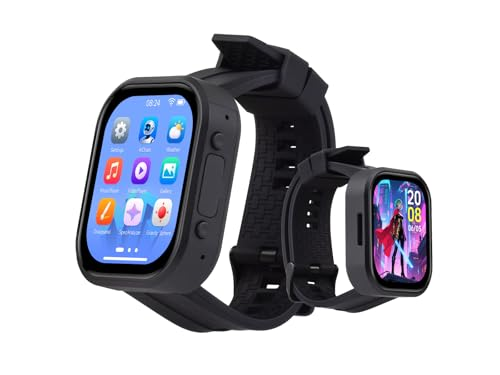
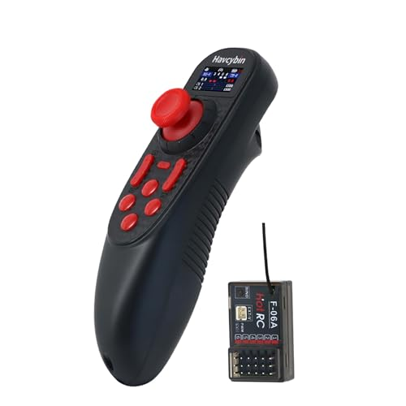
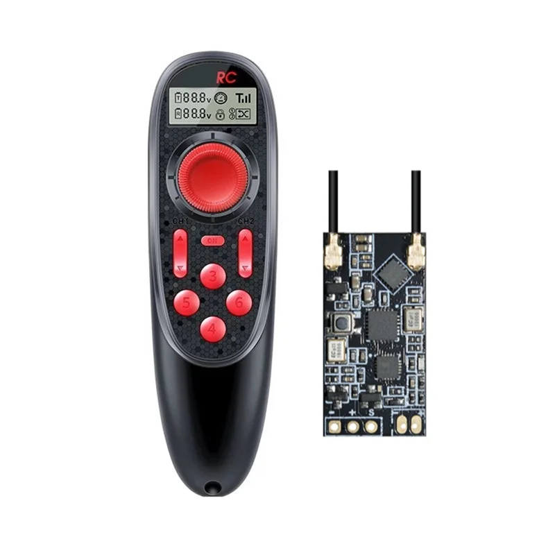
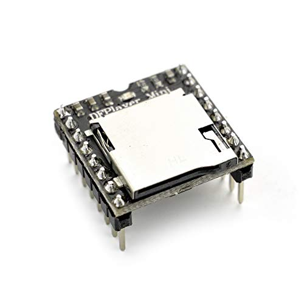
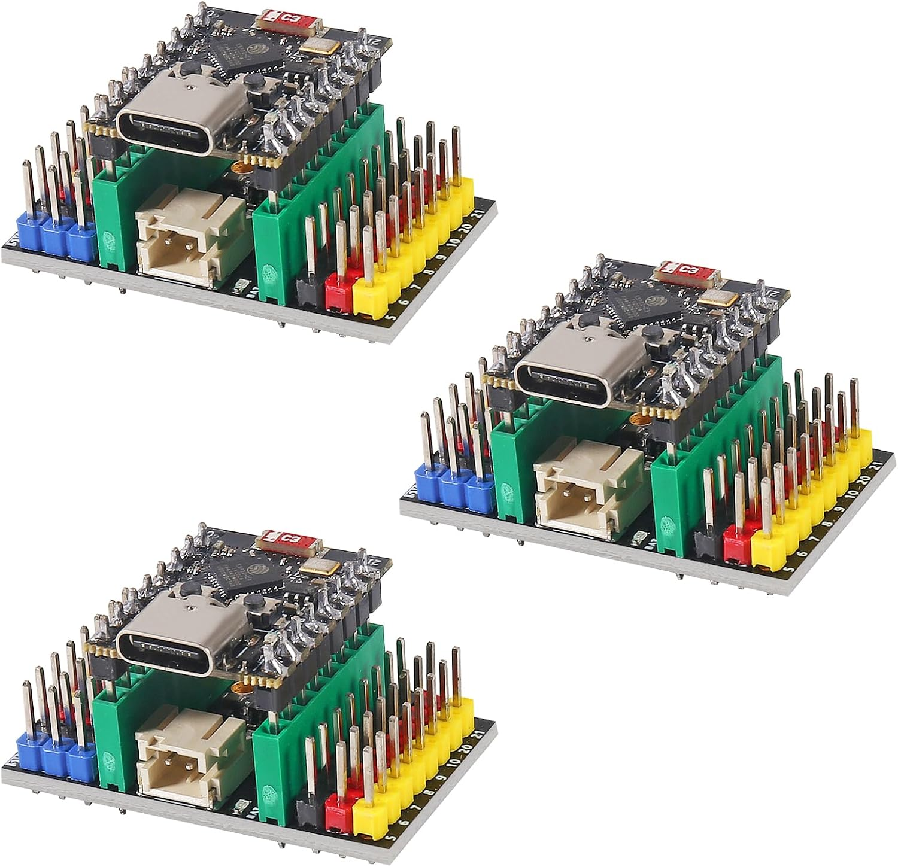
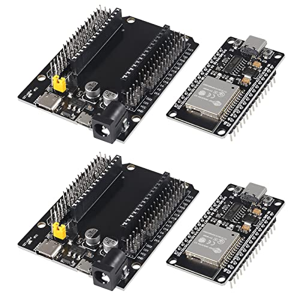

# DroidLink Main Hardware

This guide lists the main controller boards and breakout boards used to build
a DroidLink system. AstroPixels, MagicPanel, Periscope, motors, servos, power
systems, and other installed accessories are not included because those parts
are supplied or selected separately. The optional Master audio hardware is
included because DroidLink offers a dedicated DFPlayer breakout board.

Product listings and board revisions can change. Before purchasing, confirm
that the model number, connector type, header arrangement, and pin layout match
the item shown here.

## How Many Parts Do I Need?

Do not buy every item on this page. The parts needed depend on the DroidLink
features being installed.

| DroidLink component | Typical quantity | When it is needed |
|---|---:|---|
| Master Controller | 1 | Every DroidLink system requires one Master. |
| Watch Display | 1 | Required for the current DroidLink system. |
| RC transmitter and SBUS receivers | As configured | Needed when using RC drive or dome control. A typical drive-and-dome setup uses two SBUS receivers: one for drive and one for dome. |
| DFPlayer Mini and DroidLink breakout | 0 or 1 set | Optional; needed only when using the Master's local audio feature. |
| DroidLink Slave | 0 or more | Add Slave controllers only for the mechanisms being built. Each Slave needs its own ESP32 board and matching breakout. |

Start with one Master and one Watch Display. Add RC hardware, DFPlayer audio,
and Slave controllers only when those features are part of the build.

## Get a DroidLink License

A DroidLink license is required to download firmware through the DroidLink Web
Installer. A license is $80 per droid. To purchase a license, email
[droidlink77@gmail.com](mailto:droidlink77@gmail.com?subject=DroidLink%20License).
In the email, say whether you also want a DroidLink DFPlayer breakout board.

After choosing the hardware and receiving a license key, continue to the
[DroidLink Web Installer](https://droidlink.github.io/DroidLink_Installer/),
then follow [Getting Started with DroidLink](getting_started.md).

## Master Controller

A Master Controller requires one supported ESP32-S3 controller and one
compatible breakout board. Choose one controller and one breakout option.

> **Important:** Do **not** buy an external-antenna version. For the N16R8
> option, buy the version that matches the photo below.

| Item | Quantity | Status | Notes |
|---|---:|---|---|
| Supported ESP32-S3 development board | 1 | Required | The Freenove FNK0085 8 MB Flash board is preferred. The pictured Meshnology N16R8 board is also supported. Do not buy an external-antenna version. |
| ESP32-S3 breakout board | 1 | Required | Choose one of the compatible breakout options below. |

### Master board options

- **Preferred:** [Freenove ESP32-S3-WROOM FNK0085 — select 8 MB Flash; no external antenna](https://store.freenove.com/products/fnk0085)

- **Supported alternative:** [Meshnology ESP32-S3 N16R8 development board — no external antenna](https://www.amazon.com/dp/B0FRG4MWRB)

### Master breakout options

- [Freenove ESP32-S3 terminal breakout board](https://www.amazon.com/dp/B0CD2512JV)

- [Meshnology N40 ESP32/ESP32-S3 expansion board](https://meshnology.com/products/n40-esp32-expansion-board-for-esp32-esp32-s3-core-modules)

The controller must be inserted in the correct orientation. Check the breakout
board labels before applying power. Continue with
[Master Wiring and Connections](Master_Wiring_and_Connections.md) after the
controller and breakout have been selected.

## Watch Display

The current Watch Display firmware is made for the Waveshare ESP32-S3
2.06-inch AMOLED touch watch development board.

| Item | Quantity | Status | Notes |
|---|---:|---|---|
| Waveshare ESP32-S3 2.06-inch AMOLED touch watch board | 1 | Required | Current Watch Display hardware. Verify the exact board and screen size before ordering. |

- [Waveshare ESP32-S3 2.06-inch AMOLED touch watch board](https://www.amazon.com/dp/B0FJQZ7SBG)

## RC Controller and SBUS Receivers

The DroidLink Master accepts separate SBUS inputs for drive and dome control.
Include the RC hardware needed for the way the droid will be operated.

| Item | Quantity | Status | Notes |
|---|---:|---|---|
| HOTRC DS-650 RC transmitter | As configured | Required only for RC control | Use with a compatible HOTRC receiver. |
| HOTRC SBUS-A receiver | Up to 2 | Required only for RC control | A typical drive-and-dome setup uses one drive receiver and one dome receiver. |

- [HOTRC DS-650 RC transmitter](https://www.amazon.com/dp/B0FNDDMZGX)

- [HOTRC SBUS-A receiver](https://a.aliexpress.com/_mLNgzTB)

See [Master Wiring and Connections](Master_Wiring_and_Connections.md#master-power--sbus-connections)
before connecting either receiver to the Master.

## Optional Master Audio

The Master can control a DFPlayer Mini for local MP3 playback. The DroidLink
DFPlayer breakout board simplifies the connections between the Master and the
DFPlayer Mini.

| Item | Quantity | Status | Notes |
|---|---:|---|---|
| DFPlayer Mini | 1 | Required for Master audio | Plays audio files stored on a microSD card. |
| DroidLink DFPlayer breakout board | 1 | Recommended for Master audio | Sold directly by DroidLink to simplify installation and reduce wiring errors. |
| microSD card | 1 | Required for Master audio | Stores the correctly named MP3 files. |

- [DFPlayer Mini purchase example](https://www.amazon.com/dp/B089D5NLW1)

The DroidLink DFPlayer breakout board is $40. Contact
[droidlink77@gmail.com](mailto:droidlink77@gmail.com) for availability.

See [Master Wiring and Connections](Master_Wiring_and_Connections.md#dfplayer-mini-connection)
for the breakout wiring and audio-file setup.

## DroidLink Slave Controller

DroidLink Slave is optional and is added according to the mechanisms being
built. DroidLink Slave supports two controller-board arrangements. Choose
either the compact ESP32-C3 Super Mini arrangement or the full-size ESP32
DevKit arrangement for each Slave. The Installer has a separate firmware
choice for each controller.

### Compact ESP32-C3 arrangement

| Item | Quantity | Status | Notes |
|---|---:|---|---|
| ESP32-C3 Super Mini | 1 | Required | Select **DroidLink Slave — ESP32-C3 Super Mini** in the Installer. |
| ESP32-C3 Super Mini breakout board | 1 | Required | Must match the pin spacing and orientation of the selected C3 Super Mini. |

- [ESP32-C3 Super Mini and expansion-board package](https://www.amazon.com/dp/B0DMQYS1VV)

This listing includes the ESP32-C3 Super Mini and its matching expansion board.

### Full-size ESP32 DevKit arrangement

| Item | Quantity | Status | Notes |
|---|---:|---|---|
| ESP32 DevKit | 1 | Required | Select **DroidLink Slave — ESP32 DevKit** in the Installer. |
| Compatible ESP32 DevKit breakout board | 1 | Required | Confirm the breakout matches the width and pin layout of the DevKit. |

- [ESP32 DevKit and expansion-board purchase example](https://www.amazon.com/dp/B0B82BBKCY)

Do not install the ESP32-C3 firmware on an ESP32 DevKit or the ESP32 DevKit
firmware on an ESP32-C3. See
[Using DroidLink Slave](Using_DroidLink_Slave.md) for board-specific wiring and
Installer instructions.

Last reviewed: September 13, 2026.
