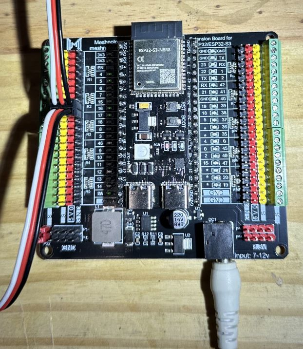
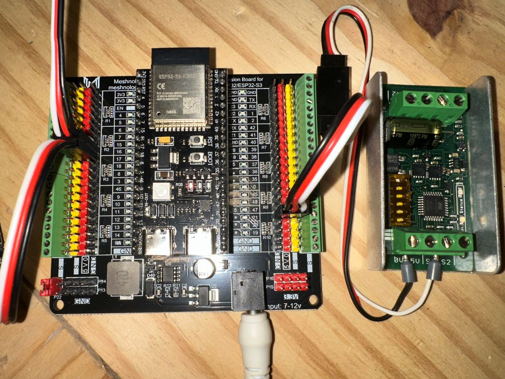
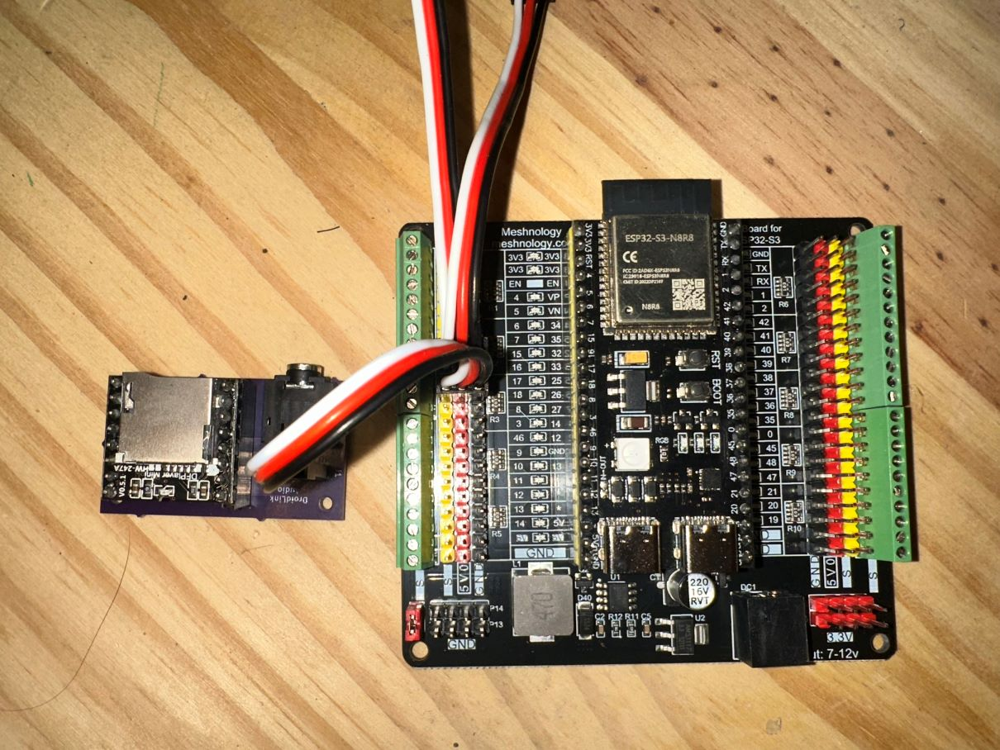
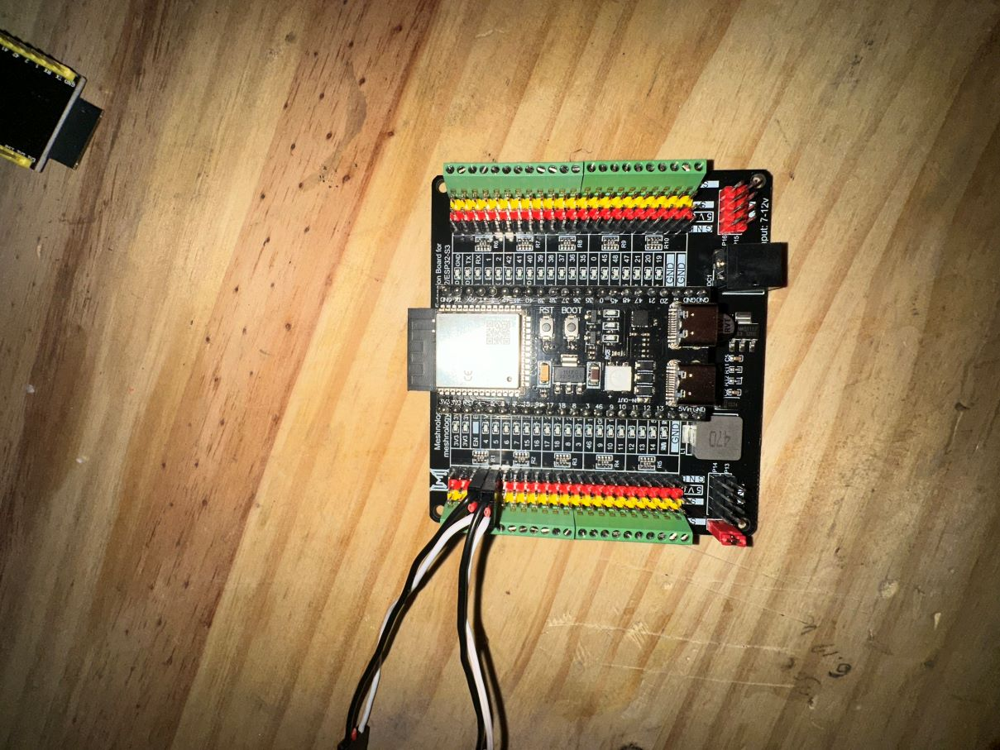

# Wiring and Connections

This guide explains how to properly wire your DroidLink hardware.

> ⚠️ Always disconnect battery power before making or modifying wiring connections.

Follow each section carefully. Incorrect wiring can prevent boot, cause instability, or damage components.

| Function         | GPIO | Description                               |
| ---------------- | ---- | ----------------------------------------- |
| SBUS Left RX     | 17   | Left receiver SBUS input                  |
| SBUS Right RX    | 16   | Right receiver SBUS input                 |
| Drive Left PWM Signal   | 4   | Left drive PWM signal (signal wire only)  |
| Drive Right PWM Signal | 5    | Right drive PWM signal (signal wire only) |
| Dome PWM Output  | 21   | Dome motor signal output                  |
| DFPlayer TX      | 18   | Serial TX to DFPlayer                     |

All GPIO references are based on the DroidLink Master firmware default pin configuration.

## Important Notes

- ⚠️ Drive controller connections use **signal and ground only**. Do **not** connect 5V from an ESC or Sabertooth to the ESP32.
- ⚠️ Ensure all grounds (ESCs, SBUS receivers, DFPlayer) are connected to a **common ground**.

---

## Master Power & SBUS Connections

The image below shows the Master Controller mounted to the breakout board,
powered via 12V DC input, with both SBUS receivers connected.

### Connection Overview

1. 12V DC input connected to breakout board barrel jack
2. ESP32-S3 Master mounted to breakout
3. Left SBUS receiver connected to GPIO 17
4. Right SBUS receiver connected to GPIO 16

---

## Dome PWM Connection

The dome motor is controlled using a PWM signal output from the Master Controller.

Connect the dome signal wire to GPIO 21.

Only the signal and ground wires are required.

### Dome Wiring Details
- Dome PWM signal connected to GPIO 21
- Dome Syren 0v connected to common ground

> ⚠️ DO NOT supply 5V from the dome controller to the ESP32.

## Master Power, SBUS Connections & Dome Controller 

The image below shows the Master Controller fully installed on the breakout board, 
with the dome PWM connection wired to GPIO 21 in addition to the existing power and SBUS connections.
--- 

> [!IMPORTANT]
> Set **DIP switch #1 to ON**.  
> Leave all other DIP switches OFF.  
> Refer to the official [SyRen 10 documentation](https://www.dimensionengineering.com/datasheets/SyRen10.pdf) 
> for correct motor wiring and battery connections.

### Master – DFPlayer Mini Connection

The DFPlayer audio module is mounted on the DroidLink DFPlayer breakout board.

The breakout board provides header connections and a 3.5mm audio output jack for simplified installation.

#### Wiring Overview

- Master GPIO 18 → DFPlayer RX (via breakout header)
- 5V → DFPlayer VCC  
- Ground → DFPlayer GND  

The RX line on the ESP32 is not used.

#### Important

- Supply 5V to the DFPlayer breakout VCC pin.␣␣
- Connect Master GPIO 18 to the breakout RX input.␣␣
- Ensure the breakout board shares a common ground with the Master Controller.

The image below shows the DFPlayer Mini installed on the DroidLink breakout board (not required but I highly suggest for cleaner/easier wiring, sold by me, $40 dollars plus shipping), with 5V power, 
ground, and the TX communication line connected from the Master Controller.

The breakout header pins are labeled VCC, GND, RX, and TX.
Connect only VCC, GND, and RX for DroidLink operation.

## 🎵 Audio Files for DFPlayer

DroidLink uses audio files stored on a microSD card inserted into the DFPlayer Mini.

Download the official DroidLink Audio Pack:

👉 **[Download DroidLink Audio Pack v1](downloads/DroidLink_Audio_Pack_v1.zip)**

---

### Installation Steps

1. Download and extract the ZIP file  
2. Format your microSD card as **FAT32**  
3. Copy the extracted `mp3` folder to the **root** of the microSD card.
4. Insert the card into the DFPlayer Mini  

Ensure the file numbering matches the track numbers used in your DroidLink mappings.

---
 
## Drive Controller Connections

The drive motors are controlled using PWM signal outputs from the Master Controller.

Each drive controller (ESC or Sabertooth) connects to the Master using a **signal wire** and a **ground**.

### Master Signal Connections

- Drive Left PWM signal → GPIO 4  
- Drive Right PWM signal → GPIO 5  
- Controller ground → System common ground  

Only the signal and ground wires connect to the Master Controller.

> ⚠️ Do NOT connect 5V from an ESC or Sabertooth to the ESP32.

---

## Sabertooth Drive Controller Wiring (RC Mode)

If you are using a Sabertooth motor controller in **RC Mode**, connect the Master PWM outputs as follows:

### Master → Sabertooth Signal Wiring

- GPIO 4 → Sabertooth **S1**
- GPIO 5 → Sabertooth **S2**
- Master GND → Sabertooth **0V / GND**

Only the signal and ground wires connect between the Master and Sabertooth.

> ⚠️ Do NOT connect 5V from the Sabertooth to the ESP32.

---

### Sabertooth DIP Switch Settings (RC Mode)

DroidLink requires the Sabertooth to be configured for **RC Mode**.

For most dual-channel Sabertooth controllers (such as 2x25 and 2x32), the typical DIP switch configuration for RC Mode is:

- Switch 1 — OFF  
- Switch 2 — ON
- Switch 3 — OFF  
- Switch 4 — OFF  
- Switch 5 — OFF  
- Switch 6 — OFF  

> ⚠️ DIP switch layouts may vary depending on model and hardware revision.  
> Always verify the correct RC Mode settings using the official Sabertooth documentation for your specific controller.

In RC Mode:
- 1500µs = Neutral  
- 1000µs = Full Reverse  
- 2000µs = Full Forward  

---

### Drive PWM Signal Connections (Master Side)

The image below shows the drive PWM signal connections on the Master Controller (used for ESC or Sabertooth in RC mode).

---

### ESC Configuration Using VESC Tool

If you are using brushless ESCs, each drive ESC must be configured using **VESC Tool** before operation.

You can download the VESC Tool here:

👉 https://vesc-project.com/vesc_tool

A recommended video walkthrough of the setup process is available here:

👉 https://youtu.be/dwMedRteUe4?si=NSW_UL7fBHayW-up

- When the video reaches the calibration step, switch to the DroidLink Master display, 
- scroll to the bottom of the Master Mode menu, and select **CALIBRATE ONLY** 
- to perform the required ESC calibration through the DroidLink system.

---

## 🚗 Drive Motor Type & Speed Cap

DroidLink supports multiple drive motor configurations:

- Brushless motors using RC ESCs (4" brushless setups)
- Sabertooth motor controllers (RC mode, brushed DC)

Because these systems differ in throttle response and torque characteristics,  
the **Max Drive Speed (%)** setting in Master Setup may need adjustment depending on your motor type.

### Recommended Starting Points

- **Brushless ESC systems:** Leave the default at **30%** for initial testing.
- **Sabertooth or brushed scooter motors:** You may increase this value as needed.  
  Many builds operate closer to **100%**, depending on gearing and droid weight.

Always increase speed gradually and test in a safe, open area.

---

### Sabertooth Configuration

Set the Sabertooth to **RC Mode** using DIP switches.

In RC Mode:

- 1500µs = Neutral
- 1000µs = Full Reverse
- 2000µs = Full Forward

Refer to your specific Sabertooth model documentation for correct DIP switch settings.

---

### Important

- Ensure Sabertooth battery ground and Master ground share a **common ground**.
- Perform motor direction verification before full-speed testing.
- Begin testing with **Max Drive Speed (%) set to 30%** and increase gradually.

---

### 🚗 Drive Mode Speed Configuration

After drive controller setup is complete (ESC calibration or Sabertooth configuration),  
drive behavior can be tuned directly from the Display.

Once you have completed all wiring and configuration guides (Master, Display, and Slave) and reviewed the Command Reference, return here to adjust drive modes.

To adjust drive speed profiles:

1. Swipe to the **Master Mode** screen  
2. Enter **Params**

From this screen, you can adjust speed scaling. Changes take effect immediately when the slider is released.

- The Param screen shows which speed mode you are in:
  - Slow Mode  
  - Normal Mode  
  - Turbo Mode  

These values define how throttle input is scaled before being sent to the drive controller.

For example:

- **Slow Mode** → Reduced maximum speed for controlled environments  
- **Normal Mode** → Standard operating speed  
- **Turbo Mode** → Maximum allowed speed  

When a drive mode is selected, the Master applies the corresponding speed profile configured here.

To exit the Param screen, hold the back button (<) for at least 2 seconds.

### Important Notes

- Drive Enable must be active for motion to occur  
- These settings adjust scaling only — they do not replace ESC calibration or Sabertooth configuration  
- Speed changes apply immediately after moving the slider  

Drive tuning allows the system to be tailored for event space, surface type, and operator preference.

---

## Master Wiring Complete

At this stage, the Master Controller should be fully wired and configured.

Before proceeding:

- Verify all signal connections  
- Confirm common ground across all devices  
- Ensure ESCs are calibrated (if applicable)  
- Confirm Sabertooth is set to RC Mode (if applicable)  
- Confirm DFPlayer audio output is functional  

Your Master wiring and drive configuration are now complete.

Proceed to [Universal Slave Wiring](Slave_Wiring.md) to continue system setup.