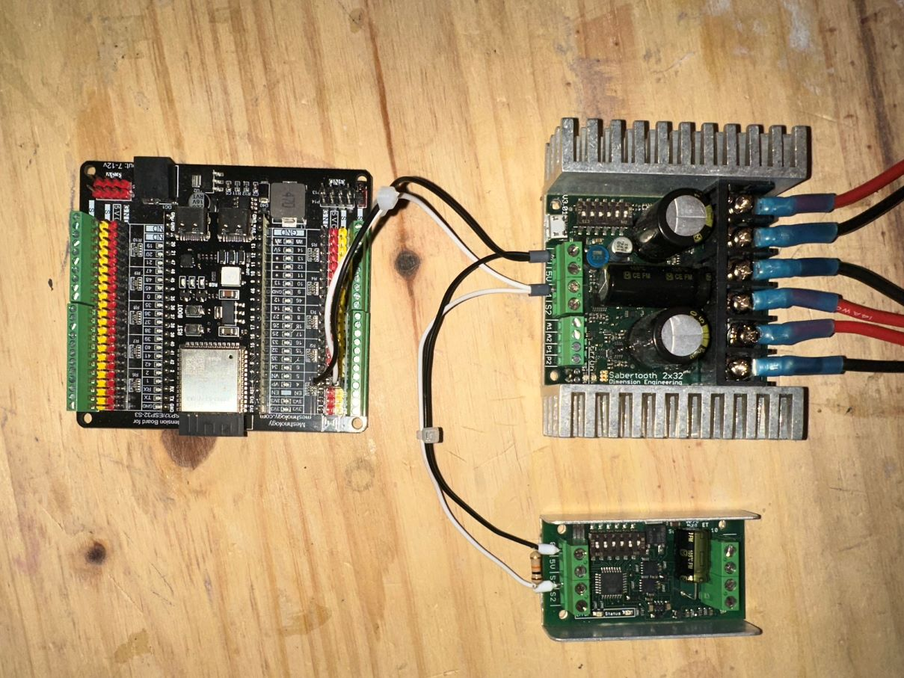

# Wiring and Connections

This guide explains how to properly wire your **DroidLink Master hardware**.

> ⚠️ Always disconnect battery power before making or modifying wiring connections.

Follow each section carefully. Incorrect wiring can prevent boot, cause instability, or damage components.

| Function                     | GPIO | Description                              |
|------------------------------|------|------------------------------------------|
| Drive Controller SBUS RX     | 17   | SBUS input from the drive RC receiver    |
| Dome Controller SBUS RX      | 16   | SBUS input from the dome RC receiver     |
| Drive Left PWM Signal        | 4    | Left drive PWM signal (signal wire only) |
| Drive Right PWM Signal       | 5    | Right drive PWM signal (signal wire only)|
| Dome PWM Output              | 21   | Dome motor signal output                 |
| DFPlayer TX                  | 18   | Serial TX to DFPlayer                    |

All GPIO references are based on the DroidLink Master firmware default pin configuration.

## Important Notes

- ⚠️ Drive controller connections use **signal and ground only**. Do **not** connect 5V from an ESC or Sabertooth to the ESP32.
- ⚠️ Ensure all grounds (ESCs, SBUS receivers, DFPlayer) are connected to a **common ground**.

---

# Master Power & SBUS Connections

The image below shows the Master Controller mounted to the breakout board,
powered via a 12V DC input, with both SBUS receivers connected.

### Connection Overview

1. 12V DC input connected to breakout board barrel jack
2. ESP32-S3 Master mounted to breakout
3. Drive SBUS receiver connected to **GPIO 16**
4. Dome SBUS receiver connected to **GPIO 17**

---

# Dome Controller Options

The dome motor can be controlled using **two supported configurations** depending on your hardware.

DroidLink supports:

* **ESC Mode (PWM control)**
* **Sabertooth Mode (Packetized Serial control)**

Choose the configuration that matches your system.

---

# Dome Controller — ESC Mode (PWM)

In ESC mode the dome motor is controlled using a **PWM signal output** from the Master.

### Wiring

* **GPIO 21 → Dome controller signal**
* **Dome controller GND → System ground**

Only the **signal and ground wires** are required.

> ⚠️ Do NOT connect 5V from the dome controller to the ESP32.

### Dome Wiring Diagram

---

## SyRen RC Mode (Optional)

If using a **SyRen motor controller in RC mode** for the dome:

Set DIP switches as follows:

| Switch | Setting |
| ------ | ------- |
| 1      | ON      |
| 2      | OFF     |
| 3      | OFF     |
| 4      | OFF     |

Refer to the official documentation for motor wiring:

https://www.dimensionengineering.com/datasheets/SyRen10.pdf

---

# Sabertooth / SyRen Serial Dome Control

When **Sabertooth mode** is enabled in the Master configuration, the dome motor is controlled using **packetized serial commands** instead of PWM.

In this configuration both motor controllers share a **single serial command bus**.

Controllers on the bus:

* Sabertooth Drive Controller (**address 128**)
* SyRen Dome Controller (**address 129**)

The Master transmits commands on **GPIO 4**, and each controller responds only to commands matching its configured address.

---

## Serial Motor Bus Wiring

| Connection    | Description         |
| ------------- | ------------------- |
| GPIO 4        | Serial motor bus TX |
| Sabertooth S1 | Serial input        |
| SyRen S1      | Serial input        |
| Master GND    | Controller ground   |

### Wiring Diagram

---

### Wiring Layout

ESP32 GPIO4
│
├── Sabertooth S1 (Drive)
│
└── SyRen S1 (Dome)

Both controllers connect to the **same signal wire**.

---

## Serial Bus Pull-Down Resistor

A **10k pull-down resistor should be connected between the S1 signal line and ground** on the serial motor bus.

This resistor keeps the S1 input line in a **stable LOW state when no commands are being transmitted**.

Without the resistor the S1 signal line can **float electrically**, which may allow electrical noise to be interpreted as data by the motor controller.
This can cause small or unintended motor movement when the system is idle.

Adding the pull-down resistor ensures the serial line remains stable and prevents false commands.

The resistor can be installed:

* at the **SyRen controller**
* at the **Sabertooth controller**
* anywhere along the shared **S1 signal line**

All points are electrically the same node.

---

## SyRen DIP Switch Settings (Packetized Serial Mode)

To use the SyRen controller with DroidLink serial control configure the switches as follows:

| Switch | Setting |
| ------ | ------- |
| 1      | ON      |
| 2      | ON      |
| 3      | OFF     |
| 4      | ON      |

This configures the controller for:

**Packetized Serial Address 129**

---

## Sabertooth DIP Switch Settings (Packetized Serial Mode)

To use the Sabertooth drive controller with DroidLink packetized serial control configure the DIP switches as follows:

| Switch | Setting |
| ------ | ------- |
| 1      | ON      |
| 2      | ON      |
| 3      | OFF     |
| 4      | OFF     |
| 5      | OFF     |
| 6      | OFF     |

This configuration enables:

* **Packetized Serial Mode**
* **9600 baud communication**
* Sabertooth **address 128**

Refer to the official Sabertooth documentation for additional configuration details:

https://www.dimensionengineering.com/datasheets/Sabertooth2x25.pdf

---

# DFPlayer Mini Connection

The DFPlayer audio module is mounted on the **DroidLink DFPlayer breakout board**.

The breakout board provides header connections and a **3.5mm audio output jack** for simplified installation.

---

## Wiring Overview

| Master  | DFPlayer |
| ------- | -------- |
| GPIO 18 | RX       |
| 5V      | VCC      |
| GND     | GND      |

The RX pin on the ESP32 is **not used**.

---

## Important

* Supply **5V** to DFPlayer VCC
* Connect **GPIO 18 → DFPlayer RX**
* Ensure the DFPlayer shares **common ground with the Master**

---

### DFPlayer Wiring Diagram

Connect the following pins:

VCC
GND
RX

The **TX pin is not required** for DroidLink operation.

---

# Audio Files for DFPlayer

DroidLink uses audio files stored on a **microSD card inserted into the DFPlayer Mini**.

Download the official DroidLink Audio Pack:

👉 **[Download DroidLink Audio Pack v1](downloads/DroidLink_Audio_Pack_v1.zip)**

---

## Installation Steps

1. Download and extract the ZIP file
2. Format the microSD card as **FAT32**
3. Copy the extracted **mp3 folder** to the root of the card
4. Insert the card into the DFPlayer

Ensure the file numbering matches the track numbers used in your DroidLink mappings.

---

# Drive Controller Options

DroidLink supports two drive controller configurations:

* **ESC Drive Systems**
* **Sabertooth Drive Systems**

Choose the configuration that matches your hardware.

---

# ESC Drive Configuration

ESC systems use standard **PWM motor control signals**.

---

## Master PWM Connections

| Function        | GPIO   |
| --------------- | ------ |
| Left Drive ESC  | GPIO 4 |
| Right Drive ESC | GPIO 5 |

### Wiring

* GPIO 4 → Left ESC signal
* GPIO 5 → Right ESC signal
* ESC ground → System ground

Only **signal and ground wires** connect to the Master.

> ⚠️ Never connect ESC 5V outputs to the ESP32.

---

## ESC Wiring Diagram

---

# ESC Configuration Using VESC Tool

If you are using brushless ESCs each ESC must be configured using **VESC Tool**.

Download here:

https://vesc-project.com/vesc_tool

Recommended setup video:

https://youtu.be/dwMedRteUe4?si=NSW_UL7fBHayW-up

When the video reaches the calibration step:

1. Switch to the DroidLink Master display
2. Scroll to the bottom of the **Master Mode** menu
3. Select **CALIBRATE ONLY**

This performs ESC calibration through the DroidLink system.

---

# Drive Motor Type & Speed Cap

DroidLink supports multiple drive motor configurations:

* Brushless motors with ESCs
* Brushed motors using Sabertooth controllers

Because these systems behave differently, drive speed may need adjustment.

---

## Recommended Starting Points

| Motor Type                  | Recommended Start |
| --------------------------- | ----------------- |
| Brushless ESC systems       | 30%               |
| Sabertooth / scooter motors | up to 100%        |

Always increase speed gradually and test in a safe open area.

---

# Drive Mode Speed Configuration

After drive controller setup is complete drive behavior can be tuned from the Display.

To adjust drive speed profiles:

1. Swipe to **Master Mode**
2. Open **Params**

You can adjust speed scaling for:

* Slow Mode
* Normal Mode
* Turbo Mode

Changes take effect **immediately** when the slider is released.

---

## Example Drive Profiles

| Mode   | Purpose              |
| ------ | -------------------- |
| Slow   | Tight indoor control |
| Normal | Standard operation   |
| Turbo  | Maximum speed        |

---

## Important Notes

* Drive must be **enabled** for motion to occur
* Speed settings adjust **scaling only**
* ESC calibration or Sabertooth configuration is still required

---

# Master Wiring Complete

At this stage the Master Controller should be fully wired and configured.

Before continuing verify:

* All signal connections are correct
* All devices share common ground
* ESCs are calibrated (if applicable)
* Sabertooth DIP switches are configured correctly
* DFPlayer audio output is functioning

---

Proceed to the next guide:

👉 **[Universal Slave Wiring](Slave_Wiring.md)**
