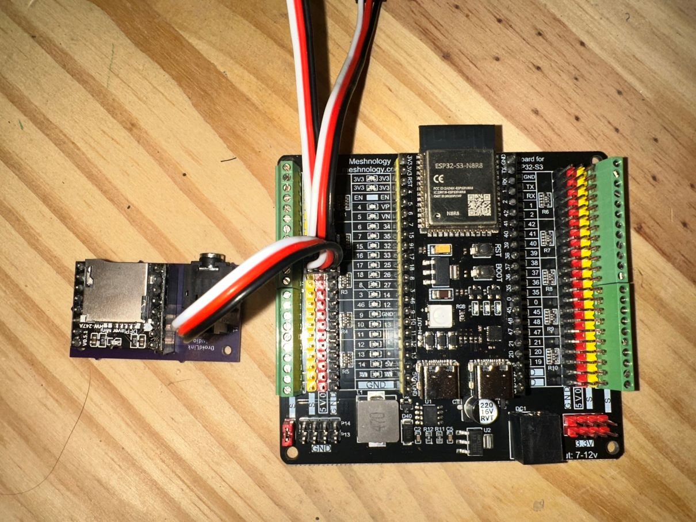

# DroidLink Documentation

**Documentation index revision 2 — Reviewed September 26, 2026**

Welcome to the public user documentation for DroidLink.

These guides explain how to install, configure, operate, update, and troubleshoot a DroidLink system. No programming experience is required.

New to DroidLink? Begin with [Start Here with DroidLink](DroidLink_Start_Here.md)
for the complete hardware, license, installation, and setup path.

- A license is required to download firmware with the DroidLink Web Installer.
- Current license pricing and purchase instructions are in [Start Here with DroidLink](DroidLink_Start_Here.md).
- Contact: droidlink77@gmail.com

## Safety and liability notice

DroidLink is a DIY hobby robotics control system. It is not intended for commercial, industrial, or safety-critical applications.

Robots can move unexpectedly and may cause injury or property damage. By building, installing, or operating DroidLink firmware or hardware, the user accepts responsibility for safe construction, testing, maintenance, and operation. Software, electronics, radio systems, wiring, and mechanical hardware can fail unexpectedly. DroidLink is provided as-is without warranty.

### Recommended safety practices

- Install an accessible physical master power switch.
- Test drive motors with the wheels raised.
- Test servos and mechanisms without linkages attached first.
- Verify RC failsafe, drive stop, and dome stop behavior before operation.
- Keep batteries and emergency power controls accessible.
- Use correctly sized, fused power supplies and common grounds.
- Never operate a droid near people, pets, or fragile property until testing is complete.
- Always supervise the droid while it is powered.

## Start here

New users should begin with [Start Here with DroidLink](DroidLink_Start_Here.md). It is the single roadmap from hardware selection through installation, pairing, safe testing, and backups.

### Link to share on Discord

Share this single link with a new user:

<https://github.com/DroidLink/DroidLink_Docs/blob/main/DroidLink_Start_Here.md>

The Start Here page links to the current Installer, required hardware, setup
order, device guides, safe testing, backups, and troubleshooting. Share a
device-specific guide only when the user is already working on that device.

## Recommended documentation path

Follow the guides in this order:

1. [Start Here with DroidLink](DroidLink_Start_Here.md) — the authoritative installation roadmap
2. [DroidLink Main Hardware](reference/Parts_List.md) — supported boards and required hardware
3. [Master and Watch Display Complete Guide](guides/Master_and_Watch_Display_Guide.md) — installation, initial setup, and pairing
4. [Master Wiring and Connections](operation/Master_Wiring.md) — power and hardware wiring
5. [DroidLink Slave Complete Guide](guides/DroidLink_Slave_Guide.md) — installation, configuration, and operation
6. [DroidLink_AP Complete Guide](guides/DroidLink_AP_Guide.md)
7. [Using DroidLink](operation/System_Overview.md) — system overview after installation
8. [Master Interface Guide](operation/Master_Interface.md) — Master configuration and operation
9. [Display Interface Guide](operation/Display_Interface.md) — Watch Display configuration and operation
10. [Master Command Reference](reference/Master_Command_Reference.md) — verified Master commands and chaining syntax
11. [Creating a Master Sequence](operation/Creating_Master_Sequence.md) — reusable timed actions
12. [Creating Display Sequences](operation/Creating_Display_Sequences.md) — chained Display commands
13. [Sentry Mode User Guide](operation/Sentry_Mode.md) — unattended random actions
14. [Remote OTA Updates](operation/OTA_Updates.md) — supported Master wireless updates
15. [Firmware Changelog](reference/Firmware_Changelog.md) — current, testing, and historical releases

## Additional device and reference guides

- [Downloadable PDF revision history](downloads/guides/PDF_Revision_History.md)
- [DroidLink_AP Maestro dome template](downloads/DroidLink_AP/DroidLink-AstroPixels-Maestro-Dome-Template.json)
- [DroidLink_AP PCA dome template](downloads/DroidLink_AP/DroidLink-AstroPixels-PCA-Dome-Template.json)
- [DroidLink Periscope Complete Guide](guides/Periscope_Guide.md)
- [DroidLink MagicPanel Complete Guide](guides/MagicPanel_Guide.md)
- [MagicPanel Command Reference](reference/MagicPanel_Command_Reference.md)

## Downloadable guides

- [Master and Watch Display Complete Guide PDF](downloads/guides/Master_and_Watch_Display_Guide.pdf)
- [Master Command Reference PDF](downloads/guides/Master_Command_Reference.pdf)
- [DroidLink Slave Complete Guide PDF](downloads/guides/DroidLink_Slave_Guide.pdf)
- [DroidLink Slave LED Strip Configuration walkthrough PDF](downloads/guides/DroidLink-LED-Strip-Configuration-HowTo.pdf)
- [DroidLink Slave Sequence Builder walkthrough PDF](downloads/guides/DroidLink-Sequence-Builder-HowTo.pdf)
- [DroidLink_AP Complete Guide PDF](downloads/guides/DroidLink_AP_Guide.pdf)
- [MagicPanel Complete Guide PDF](downloads/guides/MagicPanel_Guide.pdf)
- [MagicPanel Command Reference PDF](downloads/guides/MagicPanel_Command_Reference.pdf)
- [Periscope Complete Guide PDF](downloads/guides/Periscope_Guide.pdf)

Use the [PDF revision history](downloads/guides/PDF_Revision_History.md) to
identify the revision and checksum of a downloaded copy.

Editable versions of the Slave walkthroughs are available in the
[LED Strip Configuration walkthrough](guides/DroidLink_Slave_LED_Strip_Walkthrough.md)
and [Sequence Builder walkthrough](guides/DroidLink_Slave_Sequence_Builder_Walkthrough.md).

## Document revisions and firmware releases

Every maintained Markdown guide shows its document revision and review date
near the title. Downloadable PDFs show the same revision in the document and
are recorded with a SHA-256 checksum in the PDF revision history.

Document revisions are separate from firmware versions. The
[Firmware Changelog](reference/Firmware_Changelog.md) is the single source for
current, testing, legacy, and historical firmware versions. A firmware feature
is documented as released only after that firmware is available to users
through the DroidLink Installer and Gatekeeper.

## Optional audio hardware

A DFPlayer Mini breakout board designed for DroidLink is available to simplify audio wiring and reduce connection errors.

Current breakout-board pricing and availability are listed in [DroidLink Main Hardware](reference/Parts_List.md).

## Documentation scope

These documents are intended for end users. They cover installation, wiring, setup, commands, normal operation, supported updates, and troubleshooting.

They intentionally do not publish firmware source code, private service details, security controls, credentials, or internal communication implementation.

## Licensing

This documentation is licensed under the MIT License. DroidLink firmware and product usage are licensed separately.
