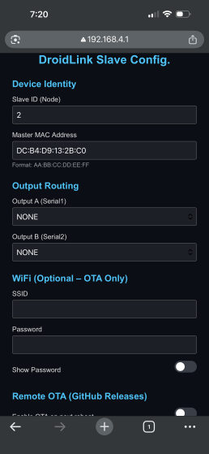

# 🔌 Slave Interface Guide

The DroidLink Slave handles hardware-level control for assigned systems such as Body, Dome, Lifter, Audio, MarcDuino, or AstroPixels.

This guide explains:

- How to configure Slave identity
- How to route outputs
- How to configure serial devices
- How to enable OTA updates
- How to save and reboot

---

## Accessing the Slave Web Interface

After installing Slave firmware:

1. Power on the Slave device
2. Connect to its Wi-Fi access point
3. Open a browser and navigate to:

`192.168.4.1`

The DroidLink Slave Config page will load.

---

## 🔧 Entering Slave Configuration Mode

A Slave must be placed into Configuration Mode before you can access its web interface.

There are two ways to do this:

---

## Method 1 — Enter Config Mode from the Display

1. Open the Display
2. Navigate to the Config Mode screen
3. Select the Slave by its Node ID
4. Activate Config Mode

The selected Slave will enter configuration mode (solid blue LED) and enable its Wi-Fi access point.

You may then connect to it and open:

`192.168.4.1`

---

## Method 2 — Manual Button Recovery

If the Display is unavailable or the Slave is not responding:

1. Press and hold the **EN** button
2. While holding EN, press and hold **Reboot**
3. Continue holding until the **blue LED turns on**
4. Release the buttons

The Slave will enter Configuration Mode.

Configuration Mode does not erase saved settings.

Its Wi-Fi access point will become available for connection.

---

## Device Identity

### Slave ID (Node)

Each Slave must have a unique Node ID.

- Master = 0
- Display = 1
- Slaves = 2 through 7

A Slave will not register correctly if its Node ID conflicts with another device.

Do not assign duplicate IDs.

After setting the Node ID, save and reboot the Slave.

---

### Master MAC Address

Enter the MAC address of your Master device.

Format:
`AA:BB:CC:DD:EE:FF`

This allows the Slave to register with the Master during boot and receive routed commands.

---

## Output Routing

Each Slave provides two serial outputs:

- Output A (Serial1)
- Output B (Serial2)

Each output can be assigned a specific role.

---

### Output Roles

You may assign each output to one of the following:

- NONE
- BODY
- DOME
- LIFTER
- AUDIO
- MARCDUINO
- ASTROPIXELS

The selected role determines how the Slave routes incoming commands from the Master.

---

## Serial Configuration

If Output A or Output B is assigned to a serial-based device, additional configuration options will appear.

You may configure:

- Device Type (Maestro Micro or Mini)
- Baud Rate

Ensure baud rate matches the connected hardware.

---

## Wi-Fi (Optional – OTA Only)

Wi-Fi credentials are only required for remote OTA updates.

If not using OTA, these fields may be left blank.

Enter:

- SSID
- Password

---

## Remote OTA (GitHub Releases)

Enable this option to trigger a firmware update on next reboot.

After enabling:

1. Save & Reboot
2. The Slave will connect to Wi-Fi
3. It will check for the latest release
4. If available, firmware will update automatically

---

## Saving Configuration

After making changes:

1. Press **Save & Reboot**
2. The Slave will restart
3. It will register with the Master
4. Capabilities will be reported automatically

---

## How Slaves Work in DroidLink

The Slave does not decide behavior.

It:

- Receives commands from the Master
- Routes them to the assigned output
- Executes hardware-level control

Behavior logic is configured on the Master.

---

## Troubleshooting

If the Slave does not register with the Master:

- Verify Node ID is unique (2–7)
- Confirm Master MAC address is correct
- Ensure both devices are powered
- Reboot both Master and Slave

If serial devices do not respond:

- Confirm correct Output Routing
- Verify baud rate matches hardware

---

## 🎉 Slave Configuration Complete

Your Slave device is now configured and ready to receive commands.

Once powered and connected, it will automatically register with the Master and become active.

## ➡️ Next Step

Learn DroidLink Command List. 

👉 **[DroidLink Command Reference→](DroidLink_Command_Reference.md)**
