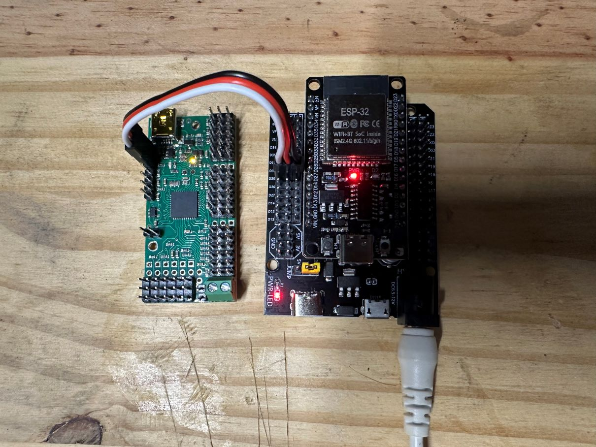
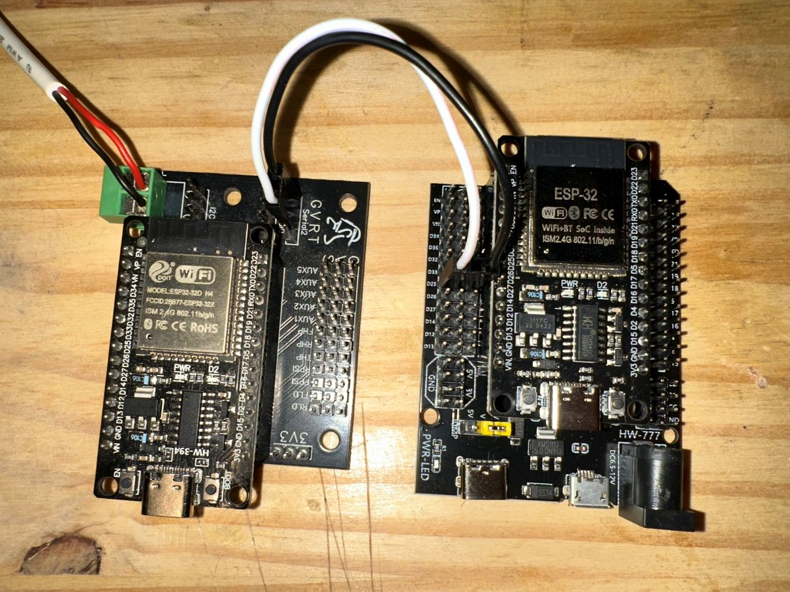

# Universal Slave Wiring

The Universal Slave controls auxiliary systems within the DroidLink ecosystem.

Supported roles include:

- Body panels (Maestro controlled)
- Dome panels (Maestro or MarcDuino controlled), including Teeces and AstroPixels lighting systems
- Lifter mechanisms (Maestro controlled)

The Slave communicates wirelessly with the Master Controller.  
No signal wiring between Master and Slave is required.

---

## Serial Outputs

Each Universal Slave provides **two independent serial outputs**:

- Serial 1 TX 25
- Serial 2 TX 17 
- Baud 9600 but can be configured 

Both serial ports are fully configurable and may be used with:

- Pololu Maestro controllers
- MarcDuino boards
- AstroPixels controllers
- Marcduino and Teeces 

There is no fixed device assignment. Either or Both serial port may be used depending on configuration.

---

## Slave to Maestro Connection

When configured, the Slave connects to a **Pololu Maestro servo controller**.

- The image below shows the Universal Slave connected to a Maestro controller using Serial 1 (TX on GPIO 25), 
- with power supplied from the Slave breakout board.

### Connection Details

- Slave TX 25 connected to Maestro RX
- Shared ground between Slave and Maestro
- Suppling 5v power (optional).

---

### Power Note

If the Maestro is powered from the Slave breakout board, You need to provide power to breakout board.

If the Maestro is not powered from the Slave breakout, it must be powered using its external power input according to the manufacturer specifications.

> ⚠️ Use only one power source for the Maestro. Do not power it from both the Slave breakout and the external power jack at the same time.

Refer to the official Maestro documentation for servo wiring, power supply requirements, and channel configuration:  
https://www.pololu.com/docs/0J40

---

## Slave to AstroPixels Connection

When configured for lighting control, the Universal Slave can connect directly to an AstroPixels controller using one of its serial outputs.

The image below shows the Universal Slave connected to an AstroPixels controller.

### Connection Details

- Slave TX - AstroPixels RX
- Slave RX - AstroPixels TX (not required)
- Shared ground between Slave and AstroPixels controller
- AstroPixels powered according to manufacturer specifications

---

## Slave to MarcDuino Connection

The Universal Slave can connect to a MarcDuino controller using either of its serial outputs.

MarcDuino devices are typically used by advanced users for sound, lighting, or custom automation systems.

### Connection Details

- Slave TX → MarcDuino Master RX
- Slave RX → MarcDuino TX (not required)
- Shared ground between Slave and MarcDuino

Power must be supplied to the MarcDuino according to its own documentation.

---

### Important

- Verify the correct serial port configuration before connecting.
- Refer to MarcDuino documentation for firmware and wiring requirements.

---

## Slave Configuration

After completing wiring, configure Serial 1 and Serial 2 from the Slave web interface.

Refer to the Slave Configuration section for:

- Assigning Serial 1 and Serial 2
- Selecting device roles (Maestro, MarcDuino, AstroPixels)
- Saving and rebooting

Proceed to the [Slave Interface Guide](Slave_Interface_Guide.md).
