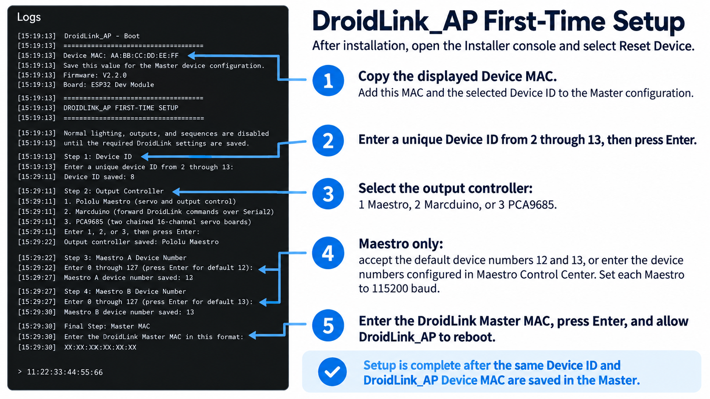

# Installing and setting up DroidLink_AP

DroidLink_AP combines AstroPixels lighting with a choice of Pololu Maestro,
PCA9685, or wired Marcduino control. Detailed operating instructions and the
commands supported by the installed firmware are available inside its Web
Config interface.

The current Installer release is **V2.3.0**.

## Choose your controller path

DroidLink_AP supports three output-controller modes. Follow only the
instructions for the hardware selected during first-time setup.

- **Pololu Maestro users:** Continue through the complete Maestro wiring and
  Maestro Control Center sections. After installation, import the Maestro dome
  template. For a standard installation, ignore the advanced assignment
  dropdowns, scroll to the bottom, and click **Apply template**.
- **PCA9685 users:** Read **Before installation**, then skip the entire section
  labeled **Maestro users only**. Complete the firmware installation and Web
  Config steps, then import the PCA9685 dome template. PCA users do not configure
  device numbers in Maestro Control Center.
- **Marcduino users:** Read **Before installation**, then skip the sections
  labeled **Maestro users only**, **Required: install the dome output template**,
  and **Advanced settings**. Marcduino mode does not use the Maestro/PCA output
  templates or servo-calibration controls.

The normal template procedure is simple: import the correct template, leave the
assignment dropdowns alone, scroll to the bottom, and click **Apply template**.
The dropdowns are only for users who deliberately changed the standard wiring.

## Output controls

Maestro and PCA9685 modes add **360-degree servo** as an output type. Each
360-degree servo stores Reverse, Stop, and Forward pulses within 1000-2000 us;
the default Stop pulse is 1500 us. Direct commands use the numbered output
shown in Web Config:

- `:DS<n>F` runs 360-degree servo output `<n>` forward.
- `:DS<n>R` runs it in reverse.
- `:DS<n>S` stops it at its saved Stop pulse.
- `:DS<n>T` toggles a normal positional-servo output `<n>` between its saved
  Closed and Full positions.

Custom output names do not change command targeting. Shared sequences operate
the same mechanism only when the receiving droid uses the same numbered output;
each droid retains its own calibration.

## Before installation

Use regulated power suitable for the connected lighting and servos. Connect
the grounds of the ESP32, controller boards, and servo power supply. Disconnect
servo linkages while establishing safe endpoints.

Choose the controller mode that matches the installed hardware:

- **Pololu Maestro:** connect ESP32 GPIO17 TX to the Maestro serial input. The
  firmware uses 115200 baud and defaults to Maestro device numbers 12 and 13.
- **PCA9685:** connect GPIO21 to SDA and GPIO22 to SCL. Configure the two boards
  as addresses `0x40` and `0x41`. Follow the
  [AstroPixelsPlus servo wiring diagram](https://github.com/reeltwo/AstroPixelsPlus/blob/main/Wiring-Diagram.png)
  for the standard dome layout.
- **Marcduino:** connect ESP32 GPIO17 TX to the Marcduino serial input. Connect
  GPIO16 RX to the Marcduino serial output when two-way communication is used.

## Maestro users only: wiring and controller setup

The [AstroPixelsPlus servo wiring diagram](https://github.com/reeltwo/AstroPixelsPlus/blob/main/Wiring-Diagram.png)
shows PCA9685 boards, but the panel and holoprojector order also applies when
using Maestro controllers. Treat the first Maestro as the **Dome Panel
Controller** in that diagram and the second Maestro as the **Holoprojector
Controller**.

> **Important numbering rule:** Maestro channels are numbered from zero. The
> first physical channel on a Maestro is **channel 0**, not channel 1. Therefore
> dome panel **P1 plugs into the Maestro's first channel, channel 0**. P2 plugs
> into channel 1, P3 into channel 2, and so on. `P1` is the panel's name; it is
> not a Maestro channel number.

### Before connecting anything

1. Turn off power to the ESP32, both Maestro controllers, AstroPixels, and the
   servo power supply.
2. Disconnect the servo linkages or otherwise make sure a moving panel cannot
   bind or damage the dome during setup.
3. Use a regulated supply suitable for the number and type of servos installed.
   Do not rely on USB power to operate the dome servos.
4. Connect the grounds of the ESP32, both Maestro controllers, AstroPixels, and
   the servo power supply together.
5. On each servo plug, verify signal, positive, and ground against the markings
   on the Maestro before applying power. Do not rely only on wire color.

### Connect the Maestro serial control wires

1. Connect ESP32 **GPIO17 TX** to the serial receive input on Maestro A.
2. Connect the same serial TX control line to the serial receive input on
   Maestro B.
3. Connect an ESP32 ground to the ground on both Maestro controllers.
4. In Pololu Maestro Control Center, set both controllers to **115200 baud**.
5. Give the controllers different device numbers. DroidLink_AP uses device
   number **12 for Maestro A** and **13 for Maestro B** by default.

### Configure both boards in Maestro Control Center

Configure the two Maestros one at a time by USB before connecting them to
DroidLink_AP. Do not assign both boards the same device number.

#### Maestro A

1. Connect only Maestro A to the computer by USB and open **Pololu Maestro
   Control Center**.
2. Open **Serial Settings**.
3. Set the serial mode to **UART, fixed baud rate** and set the baud rate to
   **115200**.
4. Set **Device Number** to **12**. Leave **Enable CRC** turned off; DroidLink_AP
   commands do not include a CRC byte.
5. Click **Apply Settings**. The number is not stored on the Maestro until the
   settings are applied.
6. Open **Channel Settings**. Set every channel used by a servo to **Servo**.
7. Set a safe **Min** and **Max** for each installed servo. These are the final
   pulse limits the Maestro will allow on that physical channel.
8. Click **Apply Settings** again, then disconnect Maestro A and label it
    **A - Device 12**.

#### Maestro B

Repeat the same procedure with Maestro B, but set **Device Number** to **13**.
Click **Apply Settings** after changing Serial Settings and again after changing
Channel Settings. Label this controller **B - Device 13**.

> **DroidLink endpoints do not replace the Maestro limits.** DroidLink_AP saves
> the requested Closed and Full pulse for each output, but the Maestro still
> enforces the Min and Max stored in Maestro Control Center. For example, if
> DroidLink_AP requests 2200 us while that channel's Maestro Max is 2000 us, the
> physical output stops at 2000 us. The same applies at the minimum end. A
> Maestro's Min and Max settings are the final controller-side safety boundary.
> Set them wide enough for the intended DroidLink calibration, but never wider
> than the servo and mechanism can safely tolerate.

### Maestro A: dome panels

Maestro A replaces the first PCA9685 board shown as the Dome Panel Controller.
Start at the Maestro's first physical output, which is printed as channel 0.

> **Why the number of outputs shown may not match the Maestro:** DroidLink_AP
> always reserves 18 output positions for Maestro A and another 18 for Maestro
> B. It does not detect whether the connected Maestro has 12, 18, or 24
> physical channels. With a 12-channel Maestro, Web Config therefore shows six
> additional positions that do not physically exist. With a 24-channel
> Maestro, Web Config uses only physical channels 0 through 17, so the board's
> final six physical channels are not available to DroidLink_AP. This does not
> shift any assignments: Maestro B always begins with DroidLink_AP output 18,
> and its physical channel 0 remains the first holoprojector connection.

| Dome connection | Maestro A physical channel | DroidLink_AP output |
|---|---:|---:|
| P1 / PANEL01 | 0 (first channel) | 0 |
| P2 / PANEL02 | 1 | 1 |
| P3 / PANEL03 | 2 | 2 |
| P4 / PANEL04 | 3 | 3 |
| P5 / PANEL05 | 4 | 4 |
| P6 / PANEL06 | 5 | 5 |
| P7 / PIE PANEL 4 | 6 | 6 |
| P8 / PIE PANEL 3 | 7 | 7 |
| P9 / PIE PANEL 2 | 8 | 8 |
| P10 / PIE PANEL 1 | 9 | 9 |
| P11 / MINI PANEL 2 | 10 | 10 |
| P12 / FRONT PSI PANEL | 11 | 11 |
| P13 / TOP PIE PANEL | 12 | 12 |

An 18-channel Maestro is recommended for Maestro A because the standard layout
uses 13 panel outputs. A 12-channel Maestro only has physical channels 0 through
11, so it cannot also hold P13. Do not move P13 to another channel unless its
assignment is also changed in Web Config.

When using two 12-channel Maestros, P13 may be connected to Maestro B physical
channel 6 and assigned to DroidLink_AP output 24. The six holoprojector servos
remain on Maestro B physical channels 0 through 5, DroidLink_AP outputs 18
through 23. Adding P13 on channel 6 does not renumber or shift any
holoprojector.

### Maestro B: holoprojectors

Maestro B replaces the second PCA9685 board shown as the Holoprojector
Controller. Again, begin with physical channel 0. DroidLink_AP shows Maestro B
as outputs 18 through 35, so physical channel 0 on Maestro B appears as output
18 in Web Config.

| Holoprojector connection | Maestro B physical channel | DroidLink_AP output |
|---|---:|---:|
| Front HP 1 / FRONT HOLO H | 0 (first channel) | 18 |
| Front HP 2 / FRONT HOLO V | 1 | 19 |
| Rear HP 1 / REAR HOLO H | 2 | 20 |
| Rear HP 2 / REAR HOLO V | 3 | 21 |
| Top HP 1 / TOP HOLO H | 4 | 22 |
| Top HP 2 / TOP HOLO V | 5 | 23 |

The remaining Maestro channels are optional and can be assigned in Web Config.
Do not confuse a physical channel number on Maestro B with the DroidLink_AP
output number. For example, **Maestro B physical channel 0 is DroidLink_AP
output 18**.

### Confirm the wiring before attaching linkages

1. Install DroidLink_AP and complete the first-time setup below, selecting
   **Pololu Maestro** as the output controller.
2. Open Web Config and import the **Maestro dome template** linked later in this
   guide.
3. Compare every imported assignment with the two tables above before enabling
   live output.
4. Test one disconnected linkage at a time. Confirm that its Web Config name
   moves the expected physical servo.
5. Calibrate safe Closed and Full positions slowly, then save that output.
6. Reconnect the linkage only after both endpoints have been confirmed safe.
7. When all outputs work correctly, save a **Complete controller backup** from
   the Welcome page.

## Install the firmware

If this is an update to an existing DroidLink_AP installation, first download a
**Complete controller backup** from the Welcome tab. Install the update without
selecting **Erase Flash** so the existing pairing and configuration can be
retained. Use **Erase Flash** only for a new installation or when intentionally
returning the device to a completely clean setup.

1. Open the DroidLink Installer in a supported browser.
2. Select **DroidLink_AP** and enter the DroidLink license key.
3. Connect the ESP32 by USB. For a new or intentionally clean installation,
   select **Erase Flash**. For an update that should retain its configuration,
   leave **Erase Flash** unselected.
4. Install the firmware and wait for installation to finish.
5. Open **Console Log** and reset the ESP32.
6. On a clean installation, follow the displayed first-time setup. Enter every
   requested value and press **Enter** after each response. An update with a
   valid retained configuration should restart without asking these questions.
7. For a clean installation, select the installed controller type, enter a
   unique DroidLink Device ID from 2 through 13, and enter the DroidLink Master
   MAC when requested. When selecting Maestro, accept device numbers 12 and 13
   only if they match the numbers applied in Maestro Control Center.
8. After DroidLink_AP restarts, add its displayed Device MAC to Master Config
   and save the Master configuration.

The console walkthrough below shows the information requested during first-time
setup. The MAC addresses shown are examples; use the addresses displayed by
your own devices.

## Open Web Config

Before connecting to the `DL_AP` Wi-Fi network, download the correct
template file to the phone, tablet, or computer that will be used for setup:

- [Download the Maestro dome template](https://raw.githubusercontent.com/DroidLink/DroidLink_Docs/main/downloads/DroidLink_AP/DroidLink-AstroPixels-Maestro-Dome-Template.json)
- [Download the PCA9685 dome template](https://raw.githubusercontent.com/DroidLink/DroidLink_Docs/main/downloads/DroidLink_AP/DroidLink-AstroPixels-PCA-Dome-Template.json)

Use the **Maestro dome template** when the servos are connected to Pololu
Maestro controllers. Use the **PCA9685 dome template** only when the servos are
connected to PCA9685 boards. These files are not interchangeable because the
second controller begins at a different DroidLink_AP output number.

From the Watch Display Settings screen, select the saved DroidLink_AP Device
ID. You can also create a Watch Display button using `:SCFG,<ID>`, replacing
`<ID>` with the saved device number.

The device restarts and creates its temporary Web Config network:

- Wi-Fi: `DL_AP`
- Password: `droidlink`
- Address: `http://192.168.4.1`

## Required: install the dome output template

Wiring the servos does not tell DroidLink_AP which panel or holoprojector is on
each output. After Web Config opens, install the template before attempting to
run panel commands or sequences.

Follow these steps exactly:

1. Select the **Outputs** tab at the top of Web Config.
2. Scroll down to **Servo/output templates**.
3. Select **Servo/output templates** to expand that section.
4. Click **Import template**.
5. The phone, tablet, or computer opens its file picker. Select
   `DroidLink-AstroPixels-Maestro-Dome-Template.json` when using Maestro
   controllers. Select `DroidLink-AstroPixels-PCA-Dome-Template.json` only when
   using PCA9685 boards.
6. Web Config displays **Assign template names to this device** followed by a
   long list of dropdowns. **These dropdowns are for advanced users creating a
   custom physical layout. Standard installations should ignore the entire
   dropdown list and must not change any of its selections.** The supplied
   template has already selected the correct standard assignments.
7. **Scroll all the way past the dropdown list to the bottom of the page.** The
   long list pushes the confirmation button far below where the template was
   imported.
8. Click **Apply template** at the bottom of the list. Wait for the status
   message confirming that the template and servo groups were applied.

The only reason to change a dropdown is when the physical wiring intentionally
differs from the standard layout. For example, an advanced user with two
12-channel Maestros may move TOP_PIE_PANEL from output 12 to Maestro B physical
channel 6, which is DroidLink_AP output 24. All other users should leave the
dropdowns alone.

9. After the template is applied, **scroll back to the top of the Outputs
   page**.
10. In the output selector, choose the first configured servo. With the standard
    template this is **PANEL01 on output 0**. For Maestro, it operates P1 on
    Maestro A physical channel 0. For PCA, it operates P1 on the first physical
    output of PCA board 1.
11. Click **Enable live output** and carefully test the selected servo with its
    linkage disconnected. Confirm that the expected physical servo moves.
12. Establish safe Closed and Full positions, then click **Save** for that
    output. Disable live output before moving to unrelated setup work.
13. Repeat the select, test, calibrate, and save process for every installed
    servo, one output at a time.
14. If an assigned servo is not physically installed, select it and mark
   **Do Not Use This Output**. Do not leave a nonexistent mechanism active.
15. Expand **Saved output table** and verify that the expected panel and
    holoprojector names appear on the correct outputs.
16. Expand **Servo groups** and confirm that the imported panel and
    holoprojector groups are present.
17. Return to the **Welcome** tab and download a **Complete controller backup**
    after every output has been tested, calibrated, and saved.

> **Do not skip the template import.** Without it, the physical servo may be
> connected correctly but DroidLink_AP will not have the standard output names,
> assignments, and servo groups expected by the supplied commands and
> sequences.

## What the template changes

Ready-to-import layouts are available in the
[DroidLink_AP template folder](https://github.com/DroidLink/DroidLink_Docs/tree/main/downloads/DroidLink_AP):

- [Maestro dome template](https://raw.githubusercontent.com/DroidLink/DroidLink_Docs/main/downloads/DroidLink_AP/DroidLink-AstroPixels-Maestro-Dome-Template.json)
- [PCA9685 dome template](https://raw.githubusercontent.com/DroidLink/DroidLink_Docs/main/downloads/DroidLink_AP/DroidLink-AstroPixels-PCA-Dome-Template.json)

The template sets up output names, output types, assignments, and servo groups.
It does not set the Device ID, Master MAC, lighting configuration, saved
sequences, or safe servo endpoints. Existing calibrated endpoints are
preserved, but a new installation must still have every servo calibrated and
saved individually.

After configuration, use **Complete controller backup and restore** on the
Welcome page to save the complete working setup.

Use **Exit Web Config** only after the template is applied, every installed
servo has been calibrated and saved, the servo groups have been checked, and a
complete controller backup has been downloaded.

## Built-in `:SE` panel movements

With the supplied dome template applied, built-in `:SE` commands can run their
AstroPixels lighting and sound together with the expected panel movement. The
saved `ALL_PANELS` group controls normal all-panel movements, and
`DOME_DANCE` controls the dome-dance movements. Do not rename those groups.

If one of those groups is missing, the lighting and sound can still run, but
the related panel movement will not. A servo marked **Do Not Use This Output**
remains blocked. DroidLink_AP supports up to 16 saved servo groups.

### Optional fifth and sixth pie panels

The standard template configures four pie panels. Six-pie users can add the
other two without changing the standard assignments:

1. Configure output rows 13 and 14 as `PIE_PANEL_5` and `PIE_PANEL_6`.
   These are Maestro A physical channels 13 and 14, or PCA A outputs A13 and
   A14.
2. Calibrate, save, and enable both outputs.
3. Add both outputs to `PIE_PANELS`, `DOME_DANCE`, and `ALL_PANELS`.
4. Confirm that `DOME_DANCE` contains 12 servos and `ALL_PANELS` contains 15.

During the built-in dome-dance sequences, pie 5 follows pie 4 and pie 6
follows pie 1. Users with four pie panels should leave the optional outputs
unused.

## Building LED and scrolling-text sequences

Each saved sequence can contain up to 512 timed actions.

Open **LED Sequence Builder** to combine timed AstroPixels lighting and
scrolling-text actions under one saved `:AP00` through `:AP31` command.

1. Click **Add Seq Action** for a normal lighting action, or click
   **Add Scrolling Text** for a matrix-text action.
2. Set the action's **Start time (ms)**.
3. For scrolling text, choose the matrix target and color. Selecting
   **Both front logic matrices (different text)** displays separate **Top
   message** and **Bottom message** fields. DroidLink_AP stores those two
   messages as one local action.
4. Add the remaining lighting or text actions. Use the drag handle on an
   action card to change its saved order. Dragging does not alter its start
   time; order is most important when multiple actions share the same start
   time.
5. Click **Run sequence** and verify the complete result.
6. Enter a sequence name, choose an available DroidLink command, and click
   **Save Sequence**.

The Master sends only the saved `:APxx` command. DroidLink_AP loads and runs
the complete timed sequence locally instead of requiring the Master to send
every lighting and text action separately.

## Advanced settings only: changing assignments and sharing sequences

This section is for users who intentionally wire a mechanism differently from
the supplied template. A standard installation should leave every assignment
dropdown unchanged, scroll to the bottom, and click **Apply template**.

### What the assignment dropdowns mean

Each row under **Assign template names to this device** represents one named
function, such as PANEL01 or FRONT_HOLO_H. The dropdown beside it selects the
physical controller output that will perform that function.

For Maestro installations:

- `A0` is Maestro A physical channel 0, the first channel on that board. It is
  DroidLink_AP output 0.
- `A1` is Maestro A physical channel 1 and DroidLink_AP output 1.
- `B0` is Maestro B physical channel 0, the first channel on the second board.
  It is DroidLink_AP output 18.
- `B1` is Maestro B physical channel 1 and DroidLink_AP output 19.

For PCA installations, the first physical output on the first PCA board is also
DroidLink_AP output 0. Therefore, **Maestro A channel 0 and the first output on
PCA board 1 are both DroidLink_AP output 0**. This matching output number—not
whether one controller is a Maestro and the other is a PCA—is what allows the
same panel command to work on both installations.

### Changing a function to another output

Only change an assignment when the mechanism is physically connected somewhere
other than the standard location.

1. Find the function in the imported assignment list.
2. Open its dropdown and select the output where that mechanism is physically
   connected.
3. Do not assign two template functions to the same output. Web Config will not
   apply a template containing duplicate targets.
4. Scroll to the bottom and click **Apply template**.
5. Open **Saved output table** and confirm the function name appears on the new
   output.
6. Select that output, test the physical mechanism, calibrate its safe
   endpoints, and click **Save**.
7. Check **Servo groups**. Groups imported with the template follow the function
   to its selected output.
8. Download a new **Complete controller backup** after verifying the change.

Changing a dropdown assigns the function name, output type, and imported group
membership to the selected output. It does not move a servo wire, create safe
endpoints, or rewrite commands inside sequences that were already created.

For example, with two 12-channel Maestros, TOP_PIE_PANEL can be physically
connected to Maestro B channel 6. In the TOP_PIE_PANEL dropdown, select `B6`,
which is DroidLink_AP output 24. After applying the template, calibrate and save
output 24. An older sequence containing a command for output 12 will still
target output 12; its command must be changed to output 24.

### What determines whether shared sequences work

DroidLink_AP sequences target **output numbers**. Custom output names are for
the user's convenience and do not change sequence targeting. Two users may name
the same panel differently and still exchange a sequence if that mechanism is
assigned to the same DroidLink_AP output number on both devices.

Before sharing a sequence, both users should verify the following:

1. Both installations use the supplied template appropriate for their
   controller type.
2. Every mechanism used by the sequence has the same DroidLink_AP output number
   on both devices.
3. Any custom assignment is duplicated on the receiving device or the sequence
   commands are edited to match the receiving device.
4. Each user calibrates their own servo endpoints. A shared sequence does not
   transfer another user's physical calibration.

With the supplied standard templates, panel outputs P1 through P13 use
DroidLink_AP outputs 0 through 12 in both Maestro and PCA modes. Panel sequences
can therefore be exchanged without renaming the panels. AstroPixels lighting
steps are also independent of Maestro versus PCA servo hardware.

### Known V2.2.0–V2.3.0 holoprojector limitation

The current templates do not use matching DroidLink_AP output numbers for the
holoprojectors:

| Holoprojector function | Maestro template | PCA template |
|---|---:|---:|
| Front Holo H | 18 | 16 |
| Front Holo V | 19 | 17 |
| Rear Holo H | 20 | 18 |
| Rear Holo V | 21 | 19 |
| Top Holo H | 22 | 20 |
| Top Holo V | 23 | 21 |

Consequently, panel and lighting steps remain correct when a V2.2.0 or V2.3.0 sequence is
shared between Maestro and PCA users, but holoprojector steps might move a
different holoprojector or do nothing. They will not be redirected to a dome
panel when both users have applied the supplied standard templates.

For V2.2.0 and V2.3.0, users can correct the exported sequence JSON before importing it:

- Maestro sequence to PCA: change holo targets 18-23 to 16-21 respectively.
- PCA sequence to Maestro: change holo targets 16-21 to 18-23 respectively.

Only holoprojector command targets should be changed. Do not change panel
targets 0 through 12 or AstroPixels lighting commands. Edit each complete
command carefully so one replacement is not accidentally processed twice.

This holoprojector numbering mismatch is a known V2.2.0–V2.3.0 limitation and is
planned to be corrected in a future DroidLink_AP release. Until that correction
is actually released, verify or convert holo command targets before exchanging
sequences between Maestro and PCA installations.
