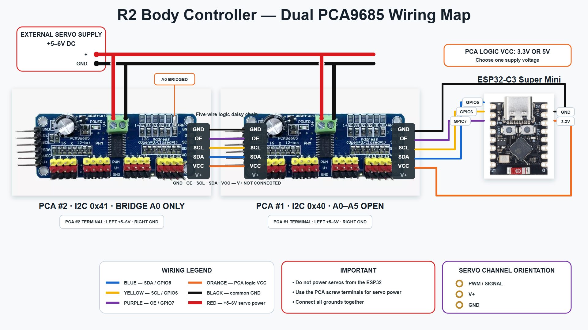

# Using DroidLink BodyPCA

DroidLink_BodyPCA is an ESP32-C3 body controller for DroidLink systems. It
uses two PCA9685 boards to operate body servos and supported accessories while
receiving commands from the DroidLink Master.

BodyPCA provides:

- Control for body drawers, doors, utility arms, and service arms.
- Web-based servo calibration and testing.
- User-created body animation presets.
- Built-in buzzsaw and trading-card dispenser support.
- Three user-named body LED segments on one GPIO4 data chain.
- Two configurable buzzsaw endstop inputs.
- DroidLink commands `BS00` through `BS99`.
- Device discovery and status reporting in Master Device Status.

See [DroidLink BodyPCA Command Reference](DroidLink_BodyPCA_Command_Reference.md) for the
complete command list.

## Required hardware

- ESP32-C3 Super Mini.
- Two PCA9685 servo-driver boards.
- A separate, appropriately sized and fused servo power supply.
- A common ground between the ESP32, both PCA9685 boards, and servo supply.

### PCA9685 connections

Connect both PCA9685 boards to the same I2C and control lines:

| ESP32-C3 | PCA9685 connection | Purpose |
|---:|---|---|
| GPIO5 | SDA | I2C data |
| GPIO6 | SCL | I2C clock |
| GPIO7 | OE | Hardware output enable, active low |
| 3.3 V | VCC | PCA9685 logic power |
| GND | GND | Common signal ground |

Leave all address jumpers open on the first PCA9685 board for address `0x40`.
Bridge A0 on the second board for address `0x41`.

Do not power body servos or LED strips from the ESP32. Connect servo power to
the PCA9685 `V+` rail using an appropriately sized and fused supply.

The ESP32-C3 GPIO pins are not 5 V tolerant. Avoid PCA9685 boards that pull
SDA or SCL up to 5 V. Use 3.3 V pull-ups or a bidirectional I2C level shifter
when necessary.

The wiring map below shows the PCA addresses, channel assignments, and shared
connections.



For a separate printable channel assignment sheet, see the
[BodyPCA PCA Channel Wiring List](DroidLink_BodyPCA_PCA_Channel_Wiring_List.pdf).

### Additional connections

| ESP32-C3 | Function |
|---:|---|
| GPIO0 | Buzzsaw deployed endstop |
| GPIO1 | Buzzsaw retracted endstop |
| GPIO4 | NeoPixel-compatible body LED data |
| GPIO8 | Onboard command-status LED |

## First-time installation

1. Disconnect servo horns and mechanical linkages.
2. Install the firmware with **Erase Flash** enabled.
3. Open the installer Console Log and reset BodyPCA.
4. Enter a unique DroidLink Device ID from `2` through `13`, then press Enter.
5. Enter the DroidLink Master MAC address, then press Enter.
6. Allow BodyPCA to save the settings and reboot.
7. Save the BodyPCA MAC address shown in the Console Log.
8. Add that MAC address to the DroidLink Master configuration and save it.
9. Allow the Master to complete its automatic reboot when required.

BodyPCA does not initialize its normal hardware or run commands until it
has a valid Device ID and Master MAC address.

Each BodyPCA must use a unique Device ID. It communicates only with the
Master MAC entered during setup.

To replace the stored Device ID or Master MAC later, connect through USB
Serial, enter `NEWMAC`, and complete setup again. Servo calibration, presets,
LED configuration, and accessory settings are preserved.

## Opening Web Config

BodyPCA normally keeps Wi-Fi off. Open its Web Config using either method:

- Select the BodyPCA Device ID from the Watch Display Settings page.
- Send `:BS,WEB,ON` from DroidLink.

You can also hold the ESP32-C3 BOOT button for approximately two seconds after
normal startup.

Then connect a phone, tablet, or computer to:

```text
Network: R2-Body-Setup
Password: r2bodysetup
Address: http://192.168.4.1
```

The onboard blue LED remains solid while Web Config is active. Use **Exit Web
Config** on the page to save your work and reboot into normal DroidLink
operation. The command `:BS,WEB,OFF` also exits Web Config.

## Servo calibration

Disconnect horns and linkages before calibrating a mechanism. Incorrect servo
endpoints can damage a servo, linkage, door, or body panel.

For each installed servo:

1. Select the servo on the Calibration page.
2. Begin with a narrow pulse range such as 1300–1700 microseconds.
3. Use the live slider to find safe closed and fully open positions.
4. Save those positions as the closed and full endpoints.
5. Enable the servo for commands and presets.
6. Test both saved endpoints before attaching its linkage.

If a mechanism is not installed, leave it disabled and mark it omitted. Saved
endpoints should be safe usable positions, not the servo’s hard mechanical
stops.

Only the selected preview servo is energized during calibration. Use the
hardware-output emergency stop immediately if a mechanism moves incorrectly.

## Body mechanisms

BodyPCA supports:

- Eight drawers: `D1` through `D8`.
- Front and rear large doors: `FL`, `FR`, `BL`, and `BR`.
- Charging-bay, data-port, and short breadpan doors: `CB`, `DP`, and `SD`.
- Upper and lower utility arms: `UA` and `LA`.
- Front and rear service-arm lift and animation servos.
- Three configurable accessory outputs: `X1`, `X2`, and `X3`.

The accessory outputs can be configured as positional servo outputs or
servo-signal switched outputs. They do not supply accessory power.

## Body LED configuration

One NeoPixel-compatible data chain connects to GPIO4. The Web Config interface
allows up to three user-named LED segments. Each segment may use a separate area
of the same physical data chain and can run independently.

The Body LEDs page provides:

- Pixel count and RGB/RGBW byte-order selection.
- Global brightness.
- Three user-named, non-overlapping segments.
- Solid-color testing.
- Built-in LED animation effects.
- User-created LED presets.

Use a separate, fused 5 V LED supply with a common ground. A 330–470 ohm data
resistor and a suitable 3.3-to-5 V logic-level shifter are recommended.

## Buzzsaw endstop inputs

GPIO0 and GPIO1 are the two supported switch inputs and are intended for the
buzzsaw deployed and retracted endstops.

Each switch connects only between its assigned GPIO and ESP32 ground. Never
apply 5 V, servo voltage, or another powered signal to these inputs.

For the supported buzzsaw configuration:

- GPIO0 is the deployed endstop.
- GPIO1 is the retracted endstop.
- Configure both as normally closed.
- Leave their optional action-command fields blank.

The built-in buzzsaw sequence opens the short breadpan door, deploys the saw,
runs the motor, retracts the saw, and closes the door. Motion stops if an
endstop timeout occurs. Send `:BS,BX` for an emergency stop.

Test the entire mechanism with its linkage disconnected before normal use.

## Trading-card dispenser

BodyPCA includes built-in support for a trading-card dispenser motor and a
calibrated cartridge-eject servo.

- `:BS75` runs the card-dispense preset.
- `:BS76` runs the cartridge-eject preset.

The eject servo must be calibrated and enabled before the eject preset can
run. The motor controller and servo require appropriate external power and a
common signal ground.

## Presets and commands

The Command Builder creates timed presets containing servo, accessory, and LED
actions. Presets are saved on BodyPCA and can be assigned to DroidLink
shortcut slots.

- `BS00`–`BS31`: user-created servo or mixed presets.
- `BS32`–`BS81`: built-in body and accessory actions.
- `BS82`–`BS89`: reserved.
- `BS90`–`BS99`: user-created LED-only presets.

Send shortcut commands through DroidLink with a leading colon, such as:

```text
:BS32
:BS65
:BS75
:BS90
```

Other BodyPCA commands use the `:BS,` envelope:

```text
:BS,BZ,D,FWD
:BS,LC,ALL,0,0,255
:BS,PR,MY_PRESET
:BS,BX
```

BodyPCA processes the enclosed body command. Refer
to [DroidLink BodyPCA Command Reference](DroidLink_BodyPCA_Command_Reference.md) for all
available commands and their meanings.

## Saving and backing up settings

Servo calibration, installed/omitted states, accessory settings, LED
configuration, switch settings, and shortcut assignments are saved in flash.
Named presets are saved separately in device storage.

Use **Export All Presets** from the Command Builder after making substantial
changes. Keep that backup before erasing flash, replacing the controller, or
changing its partition layout.

A routine firmware update should preserve settings. Installing with **Erase
Flash** deliberately restores first-time setup and may remove calibration and
presets.

## Safety

- Disconnect linkages during initial calibration.
- Use separate, properly fused power supplies for servos, motors, and LEDs.
- Always connect grounds between devices that exchange control signals.
- Verify controller signal voltage requirements before connecting accessories.
- Test one mechanism at a time.
- Keep the hardware emergency stop accessible during testing.
- Send `:BS,BX` to stop presets, servo motion, LED effects, and PCA outputs.
- Do not operate an accessory until its limits, direction, and safe state have
  been verified on the actual hardware.

## Continue

Review the [BodyPCA Command Reference](DroidLink_BodyPCA_Command_Reference.md), or return to the [Documentation Home](README.md).
